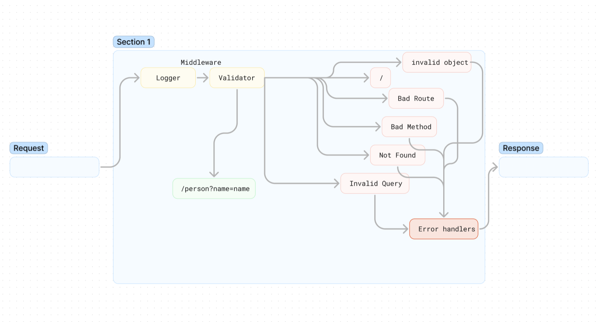

# LAB - Class 02

## Project: Basic Express Server

### Author: Donna Ada

### Problem Domain  

Dynamic API Phase 1: Build your core, standards compliant Express server. From a business requirements standpoint, we will be building a basic Express server using best practices, including server modularization, use of middleware, and tests.

#### Person Route

  - Method: GET
  - Path: /person
    - Expects a query string from the user with a “name” property
    - When present, output JSON to the client with this shape: { name: "name provided" }
    - Without a name in the query string, force a “500” error

### Links and Resources

- [GitHub Actions ci/cd](https://github.com/donnaada/basic-express-server/actions) 
- [back-end server url](https://basic-express-server-curg.onrender.com)

### Collaborators

Referenced Ryan Gallaway's Demo Code
CodeFellow TA's for assistance with server.js and server.test.js issues

### Setup

#### `.env` requirements (where applicable)

Port variable located within .env.sample

#### How to initialize/run your application (where applicable)

- e.g. `npm start`

#### How to use your library (where applicable)

Clone repo, npm i, then run nodemon in terminal

#### Features / Routes

- Feature One: Details of feature
- GET : `/person` - specific route to hit with query?name=name

#### Tests

To Run tests, run the command npm test

#### UML

